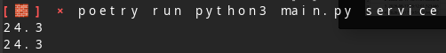
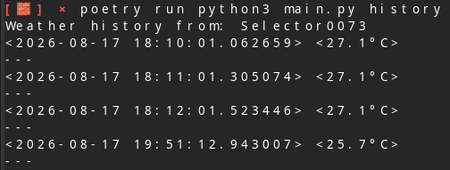
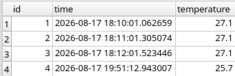

# Weather Monitor

## 1. Overview

Weather Monitor is a simple console-based Python application that retrieves weather information at regular intervals from a free weather API about a certain place and saves the data locally in a database, allowing the user to review the recorded data in the console. The application itself is minimalistic: two code files, some dependencies, and one network request only. There are two files here which are decoupled: `main.py` controls the behavior of the application (making the request, handling commands), while `db.py` manages all persistence-related issues (creating schema, inserting data).

## 2. Technologies Used and Why

| Technology   | Why it was chosen                                                                                                                                                                                             |
|--------------|---------------------------------------------------------------------------------------------------------------------------------------------------------------------------------------------------------------|
| **requests** | The de facto standard HTTP client for Python. Simpler and more ergonomic than the built-in `urllib` for making a GET request and reading the response body.                                                   |
| **peewee**   | A small, expressive ORM that maps the `Weather` table to a plain Python class (`BaseModel`/`Weather`). It avoids writing raw SQL for simple create/select operations and keeps `db.py` short and declarative. |
| **SQLite**   | A file-based, zero-configuration database — ideal for a single-user local logging tool where a full database server would be unnecessary overhead.                                                            |

## 3. Architecture

### 3.1 main.py

Responsible for the program's control flow and its interaction with the outside world:

- **URL** — a constant holding the fully-formed Open-Meteo request URL, including the target coordinates, the list of current-weather fields to return, and the Europe/Kyiv timezone.
- **service()** — the main polling loop. Each iteration performs a GET request, parses the JSON body, checks the HTTP status code and exits with an error message if the request failed, then prints and persists the temperature before sleeping for 60 seconds.
- **history()** — prints a header line and delegates to `list_data()` in `db.py` to print every stored reading.
- **main()** — builds the command dispatch table, initializes the database, reads `sys.argv[1]` as the requested command, and calls the matching function, handling a missing or unknown command with a clear error message and a non-zero exit code.

### 3.2 db.py

Responsible purely for persistence, isolated from the networking and CLI logic in `main.py`:

- **db** — a peewee `SqliteDatabase` pointing at a local `db.sqlite` file.
- **BaseModel / Weather** — an ORM model with two fields: `time` (defaults to the moment the row is created) and `temperature` (a float).
- **init_db()** — opens the database connection and creates the `Weather` table if it does not already exist.
- **add_data(temperature)** — inserts one new reading.
- **list_data()** — iterates over every stored `Weather` row and prints its timestamp and temperature.

## 4. How to Run It

Install dependencies:
```bash
poetry install
```

Run:

```bash
poetry run python3 main.py service
poetry run python3 main.py history
```

## 5. Screenshots

**Running the service command and printing live temperature readings:**



**Viewing stored history:**



**Contents of the SQLite database:**



## 6. Sources

- [Peewee Docs](https://docs.peewee-orm.com/en/latest/)
- [Geek for geeks](https://www.geeksforgeeks.org/python/command-line-arguments-in-python/)
- [Requests docs](https://docs.python-requests.org/en/latest/index.html)
- [W3](https://www.w3schools.com/python/python_json.asp)