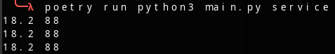
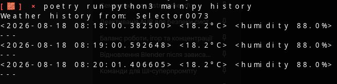
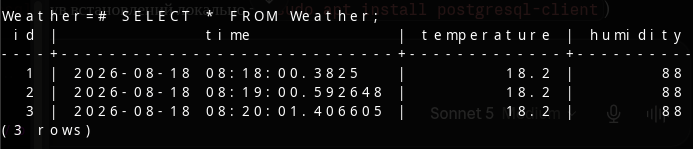

# Weather Monitor

## 1. Overview

Weather Monitor is a simple console-based Python application that retrieves weather information at regular intervals from a free weather API about a certain place and saves the data in a PostgreSQL database, allowing the user to review the recorded data in the console. The project consists of three parts: `main.py` controls the behavior of the application (making the request, handling commands), `db.py` manages all persistence-related logic (querying, inserting), and the `alembic/` directory holds version-controlled database schema migrations, kept separate from the application's runtime logic.

## 2. Technologies Used and Why

| Technology       | Why it was chosen                                                                                                                                                                                                     |
|------------------|--------------------------------------------------------------------------------------------------------------------------------------------------------------------------------------------------------------------|
| **requests**     | The de facto standard HTTP client for Python. Simpler and more ergonomic than the built-in `urllib` for making a GET request and reading the response body.                                                        |
| **peewee**       | A small, expressive ORM that maps the `Weather` table to a plain Python class (`BaseModel`/`Weather`), used together with `playhouse.postgres_ext` for PostgreSQL-specific features. Keeps `db.py` short and declarative for simple insert/select operations. |
| **psycopg2**     | The standard PostgreSQL driver for Python; required by peewee's `PostgresqlExtDatabase` to actually talk to the database over the network.                                                                          |
| **PostgreSQL**   | A full client-server database, replacing the earlier SQLite file — needed now that the data is queried through a networked service (via Docker) rather than a local file, and to support proper schema migrations. |
| **Alembic + SQLAlchemy** | Used solely for schema migrations (table/column creation), independent of the peewee models used at runtime. Keeps schema evolution (e.g. adding the `humidity` column) tracked and reversible.             |

## 3. Architecture

### 3.1 main.py

Responsible for the program's control flow and its interaction with the outside world:

- **URL** — a constant holding the fully-formed Open-Meteo request URL, including the target coordinates, the requested current-weather fields (temperature, humidity, and others), and the Europe/Kyiv timezone.
- **service()** — the main polling loop. Each iteration performs a GET request, parses the JSON body, checks the HTTP status code and exits with an error message if the request failed, then prints and persists both the temperature and humidity before sleeping for 60 seconds.
- **history()** — prints a header line and delegates to `list_data()` in `db.py` to print every stored reading.
- **main()** — builds the command dispatch table, initializes the database connection, reads `sys.argv[1]` as the requested command, and calls the matching function, handling a missing or unknown command with a clear error message and a non-zero exit code.

### 3.2 db.py

Responsible purely for persistence, isolated from the networking and CLI logic in `main.py`:

- **db** — a peewee `PostgresqlExtDatabase` connecting to the `Weather` database on `127.0.0.1:5432` with dedicated `weather` credentials.
- **BaseModel / Weather** — an ORM model with three fields: `time` (defaults to the moment the row is created), `temperature` (float), and `humidity` (float).
- **init_db()** — opens the connection to the PostgreSQL database (schema itself is managed by Alembic, not by peewee).
- **add_data(temperature, humidity)** — inserts one new reading with both values.
- **list_data()** — iterates over every stored `Weather` row and prints its timestamp, temperature, and humidity.

### 3.3 alembic/

Handles schema migrations independently from the application code:

- **68839217c732_create_weather_table.py** — creates the initial `weather` table with `id`, `time`, and `temperature` columns.
- **c367ad9581f7_add_humidity_to_weather.py** — adds the `humidity` column on top of the initial schema.
- **env.py / script.py.mako / alembic.ini** — standard Alembic configuration and migration-template scaffolding.

## 4. How to Run It

Start PostgreSQL:
```bash
docker-compose up
```

Install dependencies:
```bash
poetry install
```

Apply database migrations:
```bash
poetry run alembic upgrade head
```

Run:
```bash
poetry run python3 main.py service
poetry run python3 main.py history
```

## 5. DB Connect

To connect to PostgreSQL directly, use:
```bash
docker compose exec db psql -U weather -d Weather
```

## 6. Screenshots

**Running the service command and printing live temperature/humidity readings:**



**Viewing stored history:**



**Contents of the PostgreSQL `weather` table:**



## 7. Sources

- [PostgreSQL docker](https://www.docker.com/blog/how-to-use-the-postgres-docker-official-image/#Start-a-Postgres-instance)