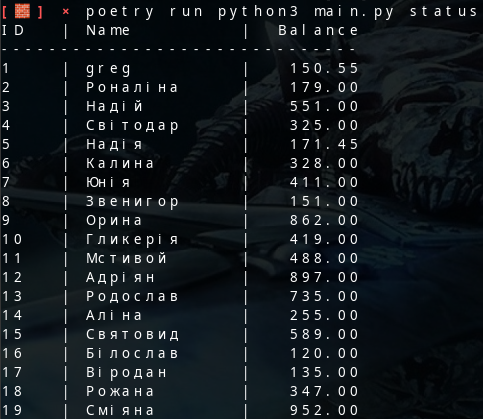
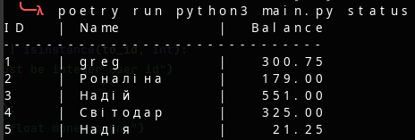

# Bank Money Manager

## 1. Overview

Bank Money Manager is a simple console-based Python application for managing user balances of a mock bank through PostgreSQL. The project consists of three parts: `main.py` handles command processing and user interaction via command-line arguments, `db.py` handles all persistence-related logic (creating tables, reading and writing data, transferring funds), and `fill_data.py` populates the database with random test accounts.

## 2. Technologies Used and Why

| Technology       | Why it was chosen                                                                                                                                                                                                     |
|------------------|--------------------------------------------------------------------------------------------------------------------------------------------------------------------------------------------------------------------|
| **peewee**       | A small, expressive ORM that maps the `Money` table to a plain Python class (`BaseModel`/`Money`), used together with `playhouse.postgres_ext` for PostgreSQL-specific features (e.g. `PostgresqlExtDatabase`). Keeps `db.py` short and declarative for simple insert/select/update operations. |
| **psycopg2-binary** | The standard PostgreSQL driver for Python; required by peewee's `PostgresqlExtDatabase` to actually talk to the database over the network.                                                                          |
| **mimesis**      | A library for generating realistic test data (in this project - random user names for the UK locale), used in `fill_data.py` to quickly populate the database with test accounts. |
| **Decimal**      | Used instead of `float` for the transfer amount in `transaction_db` to avoid rounding errors when working with monetary values.                                                                                |

## 3. Architecture

### 3.1 main.py

Responsible for processing user commands and validating them before hitting the database:

- **transaction()** - reads the sender ID, recipient ID, and transfer amount from `sys.argv`, validates the types and that the amount is positive, then calls `transaction_db()`.
- **status()** - delegates to `status_db()` to print the list of all accounts and their balances.
- **add_account()** - reads the owner's name and starting balance from the command-line arguments and calls `add_account_db()`, handling invalid parameters.
- **main()** - builds the command dispatch table (`transaction`, `status`, `add_account`, `fill-data`), initializes the database connection via `init_db()`, reads `sys.argv[1]` as the requested command, and calls the matching function, handling a missing or unknown command with a clear error message and a non-zero exit code.

### 3.2 db.py

Responsible purely for persistence, isolated from the CLI logic in `main.py`:

- **db** - a peewee `PostgresqlExtDatabase` connecting to the `Money` database on `localhost:5432` with `bank` credentials.
- **BaseModel / Money** - an ORM model with fields `id` (primary key), `owner` (unique text field - the account holder's name), and `balance` (a decimal field with the constraint `balance >= 0.0`, which prevents the balance from going negative).
- **init_db()** - opens the connection to the database and creates the `Money` table if it doesn't already exist (`safe=True`).
- **transaction_db(from_id, to_id, amount)** - looks up both accounts by ID, checks that the sender has sufficient funds, then atomically decreases the sender's balance and increases the recipient's balance, saving both records.
- **status_db()** - prints a table of all accounts, sorted by `id`, in a formatted layout (ID, name, balance).
- **add_account_db(owner, balance)** - creates a new `Money` record with the given owner and starting balance, handling an attempt to create a duplicate via `IntegrityError`.

### 3.3 fill_data.py

A helper script for populating the database with test data:

- **fill_random_data()** - uses `mimesis.Person` (UK locale) to generate 10 random names and random balance amounts between 1 and 1000, creating a new account for each one via `add_account_db()`.

## 4. How to Run It

Start PostgreSQL:
```bash
docker-compose up
```

Install dependencies:
```bash
poetry install
```

Run commands:
```bash
poetry run python3 main.py fill-data
poetry run python3 main.py add_account <name> <balance>
poetry run python3 main.py status
poetry run python3 main.py transaction <from_id> <to_id> <amount>
```

## 5. DB Connect

To connect to PostgreSQL directly, use:
```bash
docker compose exec db psql -U bank -d Money -h localhost -p 5432
```

## 6. Screenshots





## 7. Sources

- [Peewee docs](http://docs.peewee-orm.com/)
- [Mimesis docs](https://mimesis.name/master/index.html)