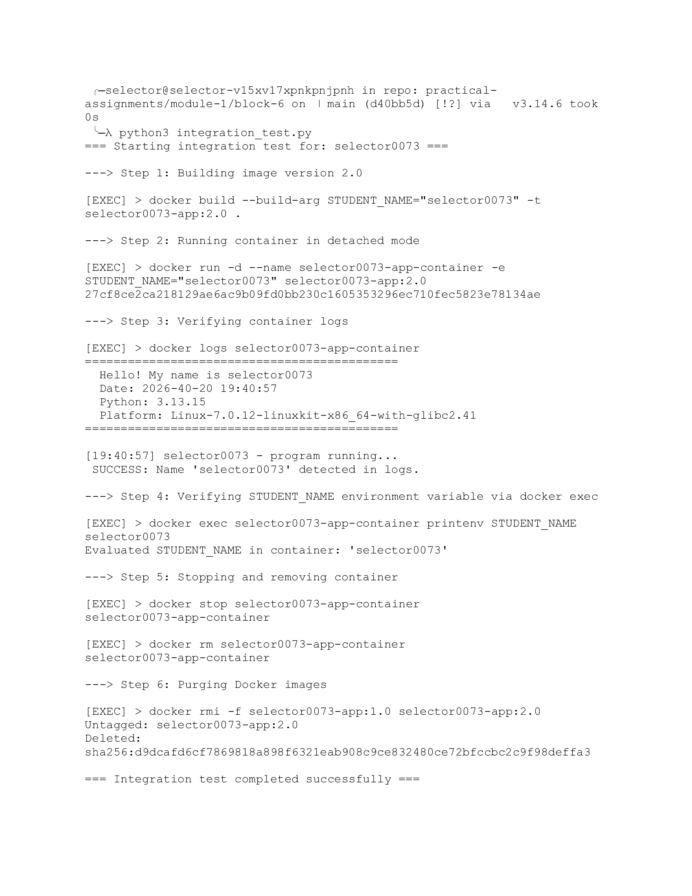

## 1. Overview

The project is a minimal Python application packaged into a Docker image, per assignment #13 ("Installing Docker. Basic commands"). The project consists of the following files:

- `main.py` - the application, which prints a greeting, the current date/time, system information, and then, in a loop, prints a timestamped message every 5 seconds.
- `dockerfile` - a Dockerfile based on `python:3.13-slim` that builds the image and runs `main.py`.
- `integration_test.py` - a custom Python script that automates the full verification cycle (build -> run -> logs -> exec -> stop -> rm -> rmi) instead of running the commands manually.

## 2. How to Run It

Build the image:
```bash
docker build -t selector0073-app:1.0 .
```

Run in detached mode:
```bash
docker run -d --name my-app-bg selector0073-app:1.0
```

View logs:
```bash
docker logs -f my-app-bg
```

Run commands inside the container:
```bash
docker exec my-app-bg python --version
docker exec -it my-app-bg bash
```

Stop and remove:
```bash
docker stop my-app-bg
docker rm my-app-bg
docker rmi selector0073-app:1.0
```

Or run the automated scenario:
```bash
python3 integration_test.py
```

## 3. Screenshoot



## 4. Sources

- [platform library docs](https://docs.python.org/3/library/platform.html)
- [Docker docs](https://docs.docker.com/get-started/)
