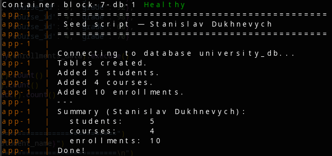

## 1. Overview

This project provides an infrastructure solution for deploying a PostgreSQL relational database in an isolated containerized environment with an automated migration mechanism. The architecture departs from manual script execution in favor of a declarative approach via Docker Compose, where the database and the seed script are deployed as interdependent services. Data persistence is ensured by Docker volumes, preventing data loss during replication or container restarts.

## 2. Technologies Used and Rationale

| Technology | Selection Rationale |
| --- | --- |
| **Docker Compose** | Provides orchestration for multi-container applications, automates network creation, and manages volumes. |
| **PostgreSQL 16 (Alpine)** | Lightweight relational DBMS image. Utilizing Alpine Linux minimizes the attack surface and resource consumption. |
| **Peewee ORM** | Optimal Object-Relational Mapping tool for small-scale projects. Provides an `atomic()` context manager to maintain ACID properties. |
| **psycopg2-binary** | High-performance PostgreSQL adapter for Python, required for Peewee abstractions to function correctly. |
| **Python 3.11 (Alpine)** | Provides an ephemeral execution environment for the migration script with a minimal image footprint. |

## 3. System Architecture

### 3.1 Environment Variables (`.env`)

Centralized configuration management is handled via the `.env` file. Credentials and target database parameters are injected directly into containers as environment variables. The `STUDENT_NAME` variable is set to `Stanislav Dukhnevych` for automatic parsing and creation of the corresponding administrator record (the initial student) in the database.

### 3.2 docker-compose.yml

Declares the system topology comprising two services:

* **db** — Persistent database service. Includes a `healthcheck` configuration executing `pg_isready` periodically to verify DBMS readiness. Data is mounted to the persistent volume `uni-pgdata`.
* **app** — Ephemeral service built from a local `Dockerfile`. Execution depends strictly on the `db` state via `condition: service_healthy`, preventing race conditions during database connection attempts.

### 3.3 Dockerfile

Defines the image build process for the migration service. Based on `python:3.11-alpine`. The `RUN pip install --no-cache-dir` directive minimizes final layer size by omitting the package manager cache. Execution of `seed.py` is initialized via `CMD`.

### 3.4 seed.py

Encapsulates the initialization logic for DDL schemas and DML operations:

* **Data Models:** Defines `Student`, `Course`, and `Enrollment` classes inheriting from `BaseModel`. Implements strict constraints (e.g., `unique=True` for email addresses). Relationships are defined using `ForeignKeyField`.
* **Transactionality:** DML execution (inserting 5 students, 4 courses, and 10 enrollments) is encapsulated within a `with db.atomic()` block. This guarantees atomicity; if an exception occurs (e.g., `IntegrityError`), the database avoids partial or inconsistent states.
* **Idempotency:** Re-execution safety is achieved by running `drop_tables` prior to table creation, preventing duplicate data accumulation.

## 4. Deployment Instructions

Initialize infrastructure and build application image:

```bash
docker compose up --build
```

## 5. Images


