- Requests were made via `Postman`.
- CRUD was made by standard `ModelViewSet`
- Filtering was implemented based on `django-filter` library
- Statistics was implemented based on `Pygal` library
- `Tasks` table inherits `ModelMixin` which contains `uuid`, `created_at`, `updated_at` fields.
- Models:
    - `tasks/models.py`
    - `common/models.py` (ModelMixin)
- Router:
    - `todo/urls.py`
    - `tasks/urls.py`
- Logic:
    - `tasks/views.py`

### admin panel:
- username: admin
- password: admin

# Screenshot
### SQLite studio
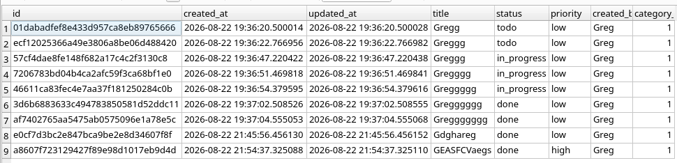

### POST /api/categories/
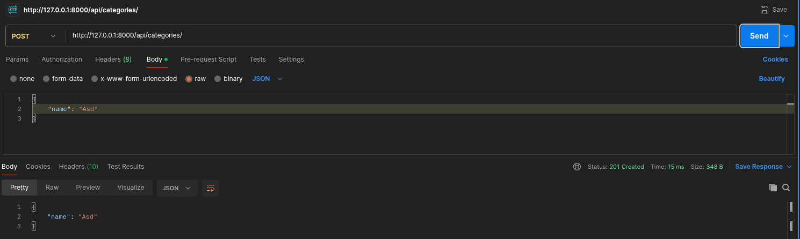

### GET /api/categories/1/tasks/
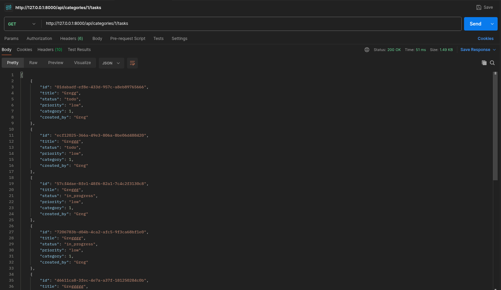

### GET /api/tasks/stats/
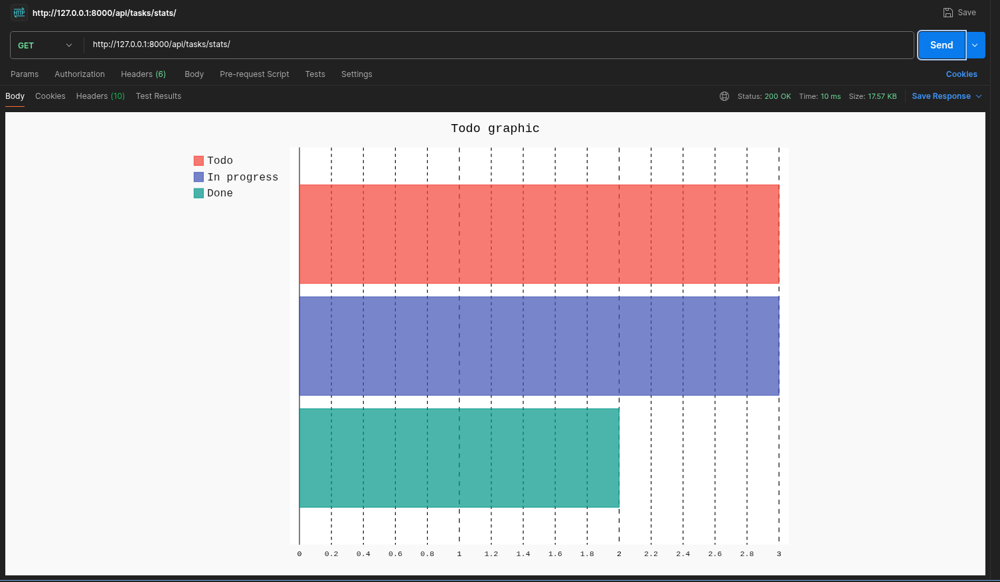

### DELETE /api/tasks/ID/
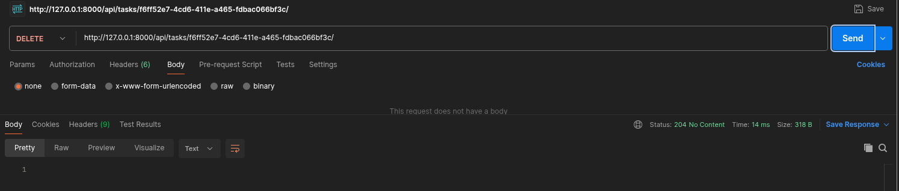

### GET /api/tasks
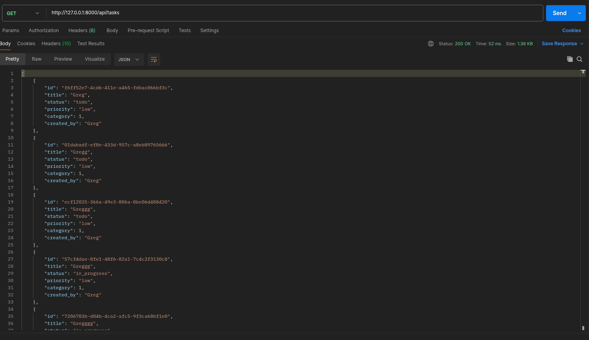

### GET /api/tasks?status=in_progress
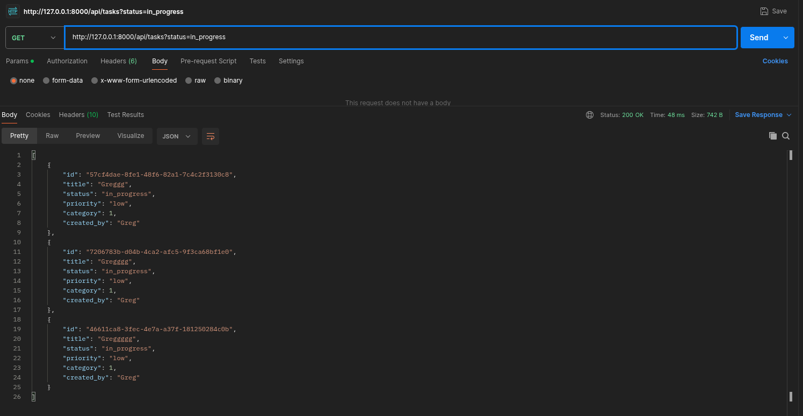

### GET /api/tasks?priority=high
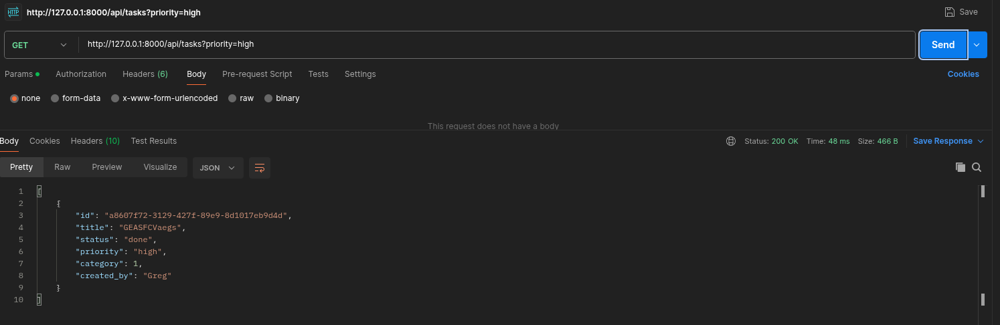

### GET /api/tasks/ID
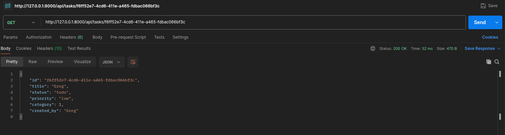

### GET /api/tasks/99
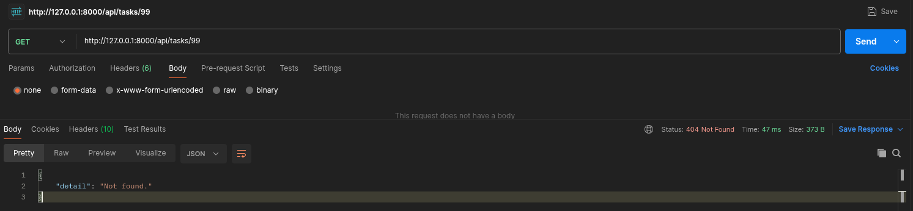

### POST /api/tasks/
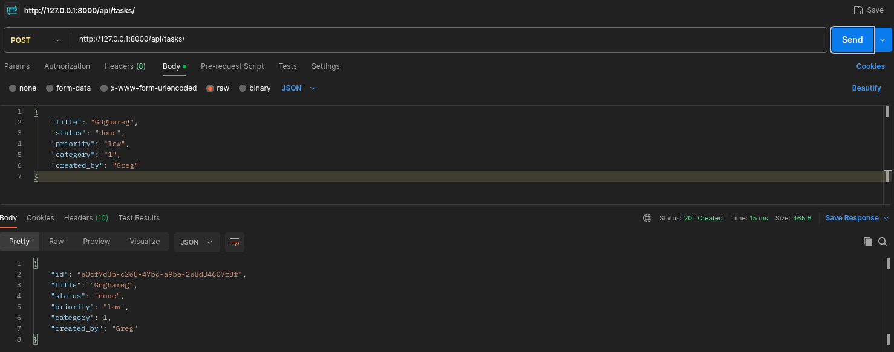

### PUT /api/tasks/ID
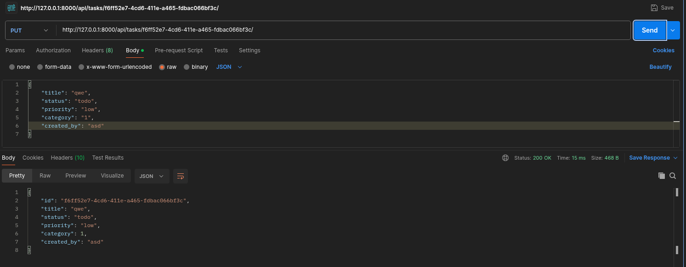