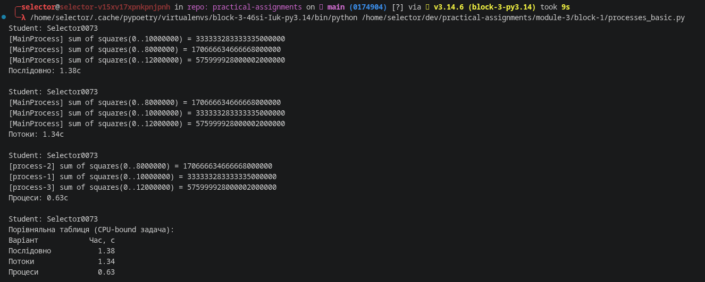
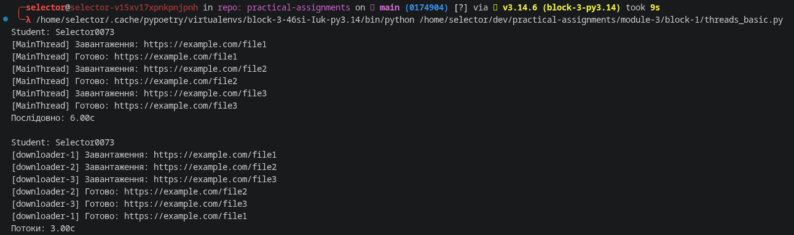

## Part 1 - Threads (`threads_basic.py`)

### What was implemented

- A `download(url: str, delay: float) -> None` function that simulates a
  file download: it prints a "Downloading" message, sleeps for `delay`
  seconds using `time.sleep`, then prints a "Done" message.
- Three simulated downloads with delays of 3, 1, and 2 seconds.
- **Sequential execution**: the three downloads are run one after another
  in a plain `for` loop, and the total time is measured with
  `time.perf_counter()`.
- **Threaded execution**: each download is wrapped in a `threading.Thread`,
  given an explicit name (`downloader-1`, `downloader-2`, `downloader-3`),
  started, and then joined. The function prints the calling thread's name
  via `threading.current_thread().name`, so the log lines show which
  thread produced each message.

### How it works

Because `time.sleep()` releases the GIL, the three threads can wait
concurrently instead of one after another. As a result:

- **Sequential run**: ≈ 6 seconds (3 + 1 + 2, one after another).
- **Threaded run**: ≈ 3 seconds (bounded by the slowest download, since all
  three sleep at the same time).

Sample output confirms this - the "Downloading" messages for all three
threads appear almost immediately, and the "Done" messages arrive
in the order their delays finish (`downloader-2` first, then
`downloader-3`, then `downloader-1`), regardless of start order.

### Measured results

| Mode      | Time     |
|-----------|----------|
| Sequential| ~6.00 s  |
| Threaded  | ~3.00 s  |

This demonstrates that threads are effective for **I/O-bound** tasks
(such as network downloads), where most of the time is spent waiting
rather than doing CPU work.

---

## Part 2 - Processes (`processes_basic.py`)

### What was implemented

- A CPU-bound `compute(n: int) -> None` function that calculates the sum
  of squares from `0` to `n` (`sum(i * i for i in range(n))`) and prints
  the result together with the name of the process that computed it
  (`multiprocessing.current_process().name`).
- Three tasks with different values of `n` (10,000,000 / 8,000,000 /
  12,000,000).
- All process-spawning code is guarded by
  `if __name__ == "__main__":`, which is required on Windows/macOS to
  prevent child processes from recursively re-importing and re-running
  the spawning code.
- Three execution modes were measured for comparison:
  1. **Sequential** - a plain loop calling `compute()` directly.
  2. **Threaded** - the same tasks run via `threading.Thread`, included to
     show that threads do **not** help with CPU-bound work.
  3. **Multiprocessing** - the same tasks run via
     `multiprocessing.Process`, each with its own name
     (`process-1`, `process-2`, `process-3`).

### How it works

`compute()` is pure CPU work (no I/O, no waiting), so:

- Threads are limited by Python's Global Interpreter Lock (GIL): only one
  thread can execute Python bytecode at a time, so running the tasks in
  threads gives essentially no speed-up over sequential execution.
- Processes each get their own Python interpreter and their own GIL, so
  they can run on separate CPU cores truly in parallel, giving a real
  speed-up on multi-core machines.

## Screenshot

---

## Conclusion

- **Threads** are well suited for **I/O-bound** tasks (network requests,
  file downloads, waiting on external resources), because waiting
  releases the GIL and lets other threads make progress.
- **Processes** are well suited for **CPU-bound** tasks (heavy
  computation), because each process has its own interpreter/GIL and can
  run on a separate CPU core, giving true parallelism.
- Using threads for CPU-bound work (as shown in Part 2) does not provide
  a meaningful speed-up, which is a direct illustration of the GIL's
  effect on Python multithreading.