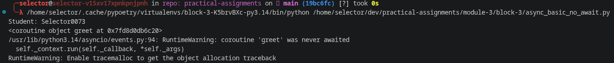
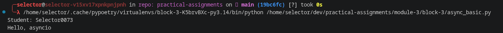
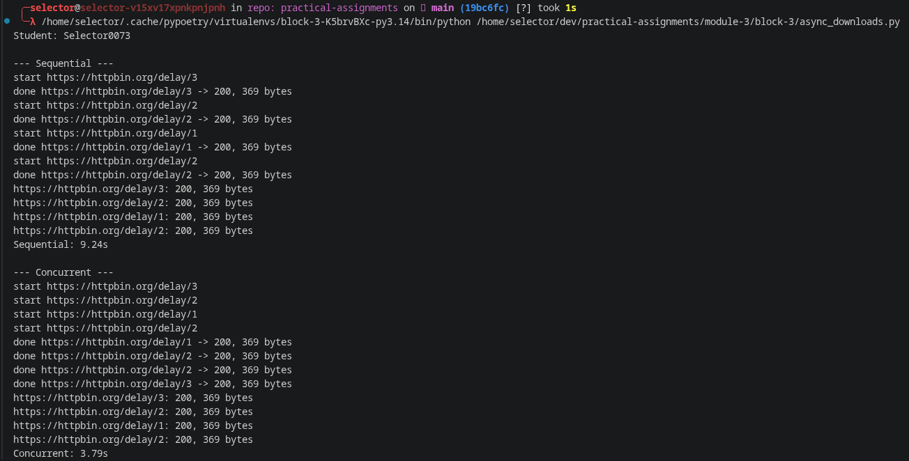
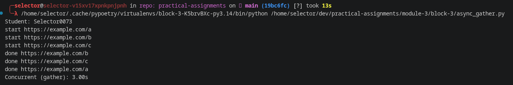
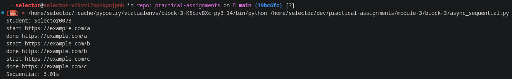

# Asyncio Practice Report

**Student:** Selector0073 *(replace with your own name/surname in Latin script - also update the `STUDENT` constant in every `.py` file)*

This report covers running coroutines with `asyncio.run`, comparing sequential vs. concurrent execution with `asyncio.gather`, and performing real HTTP requests asynchronously with `aiohttp`.

---

### async_basic_no_await

### async_basic

### async_download

### async_gather

### async_sequential
